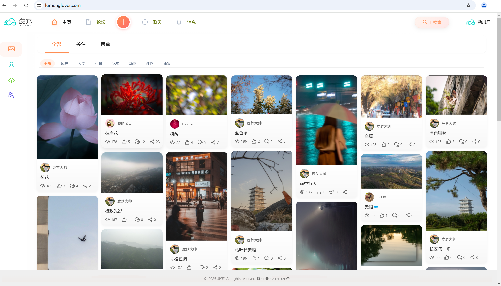
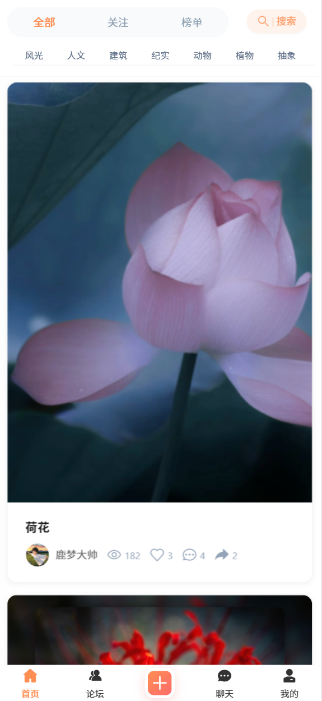
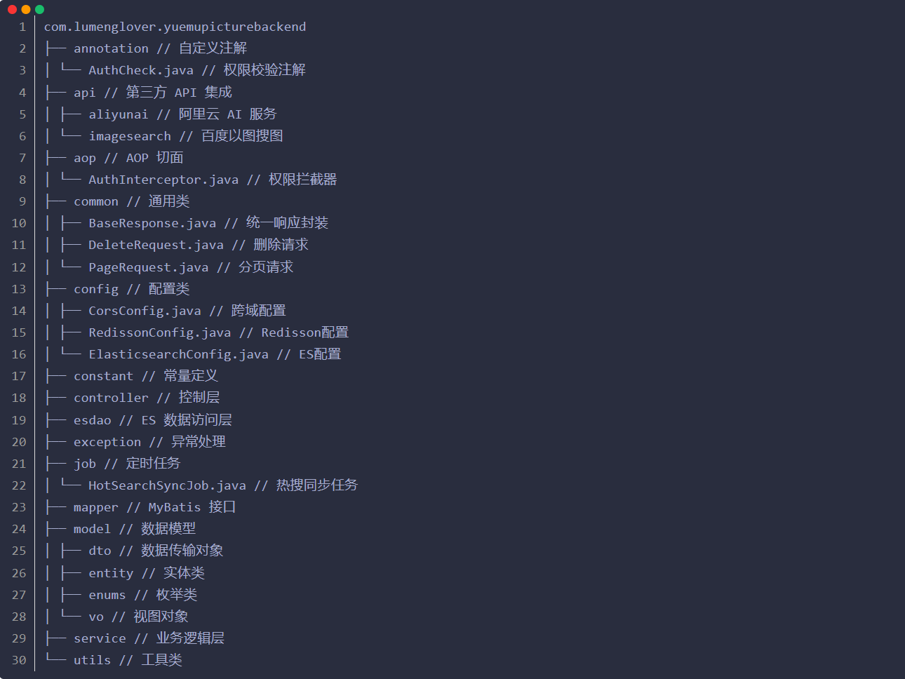

# 悦木图片管理系统后端

## 项目介绍
悦木图片管理系统是一个基于 Spring Boot + Vue3 的图片管理平台，由程序员鱼皮的项目二次开发，支持图片上传、分享、搜索、AI 扩图等功能。本仓库为后端部分。系统采用前后端分离架构，提供 RESTful API 接口。

## 技术栈

### 核心框架
- Spring Boot 2.7.x - 应用基础框架
- Spring MVC - Web 框架
- MyBatis Plus 3.5.x - ORM 框架
- MySQL 8.0 - 关系型数据库
- Redis 6.x - 缓存数据库
- Elasticsearch 7.17.x - 搜索引擎
- WebSocket - 实时通信

### 存储
- 腾讯云 COS 对象存储 - 图片文件存储
- MySQL - 业务数据持久化
- Redis - 缓存、计数器、限流
- Elasticsearch - 全文检索、数据分析

### 中间件
- Redisson - 分布式锁、限流
- Spring Task - 定时任务调度
- Spring AOP - 权限校验、日志记录
- Swagger - API 文档生成

### AI 能力
- 阿里云 AI 扩图服务 - 图片智能扩展
- 百度以图搜图 API - 相似图片搜索

## 系统架构

### 整体架构

### 分层架构

## 核心功能详解

### 1. 用户模块
- 用户注册：支持邮箱注册，密码加密存储
- 用户登录：Redis 存储会话
- 用户管理：基本信息修改，头像上传
- 权限控制：基于 RBAC 的权限管理

### 2. 图片管理
- 图片上传：
    - 支持单图/多图上传
    - 自动生成缩略图
    - 腾讯云 COS 存储
    - 图片元信息提取
- 图片处理：
    - AI 扩图（阿里云服务）
    - 图片压缩
    - 水印添加
- 图片组织：
    - 分类管理
    - 标签系统
    - 相册功能
- 图片安全：
    - 敏感内容检测
    - 访问权限控制
    - 防盗链设置

### 3. 空间管理
- 空间类型：
    - 个人空间
    - 团队空间
- 成员管理：
    - 角色分配
    - 权限控制
    - 成员邀请
- 容量控制：
    - 空间配额
    - 使用统计
    - 容量预警

### 4. 搜索系统
- 搜索功能：
    - 全文检索
    - 以图搜图
    - 高级筛选
- 数据同步：
    - MySQL -> ES 数据同步
    - 定时任务更新
- 性能优化：
    - 多级缓存
    - 热门搜索缓存
    - 搜索建议

### 5. 社交功能
- 互动功能：
    - 点赞
    - 收藏
    - 评论
    - 分享
- 关注系统：
    - 用户关注
    - 动态推送
- 消息系统：
    - WebSocket 实时通知
    - 系统通知
    - 互动消息

## 核心特性

### 1. 高可用设计
- 服务无状态，支持水平扩展
- 分布式锁保证并发安全

### 2. 高性能
- 多级缓存架构
    - 本地缓存
    - Redis 分布式缓存
    - Elasticsearch 搜索缓存
- 异步处理机制
    - 消息通知异步化
    - 图片处理异步化
    - 搜索数据异步同步

### 3. 安全性
- 数据安全：
    - 敏感数据加密
    - 数据访问控制
    - 操作日志记录
- 系统安全：
    - SQL 注入防护

### 4. 可扩展性
- 模块化设计
- 接口标准化
- 配置外部化
- 支持插件扩展

## 部署说明

### 环境要求
- JDK 1.8+
- MySQL 8.0+
- Redis 6.x+
- Elasticsearch 7.17.x
- Maven 3.6+
- Nginx 1.18+

## 联系方式
- 作者：鹿梦
- 邮箱：109484028@qq.com
